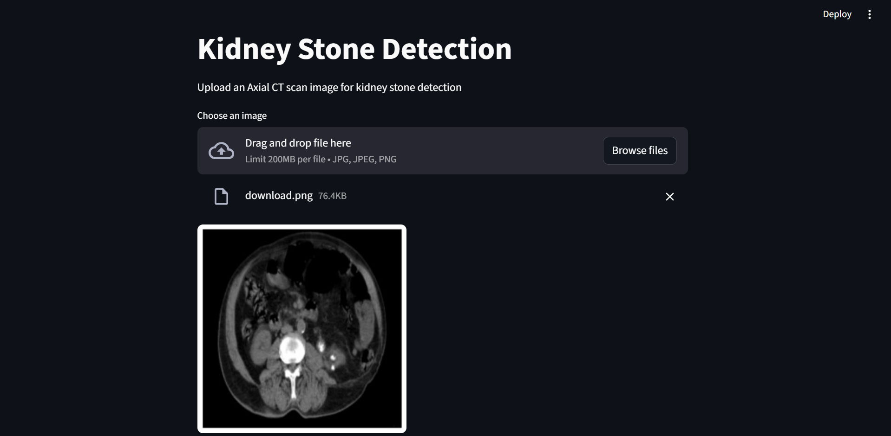

# Kidney Stone Classification Web App

## Overview
A minimalistic and lightweight kidney stone image classification web application built using TensorFlow, Streamlit, and OpenCV/Pillow.
The app allows users to upload a kidney CT-scan image and instantly get a prediction from a trained deep-learning model.



## Technical Stack
-Python 3
-TensorFlow / Keras
-Streamlit
-OpenCV / Pillow
-NumPy
-Scikit-image

## Dataset
This dataset provides a high-quality collection of Axial CT scan images for kidney stone detection, carefully curated and labeled by experienced medical professionals.
[Axial CT Imaging Dataset](https://www.kaggle.com/datasets/orvile/axial-ct-imaging-dataset-kidney-stone-detection/data)

## Installation and Setup
### Model Training:
The colab file for model training[kidney_2.ipynb](kidney_2.ipynb)

### Clone the Repository:
```
git clone https://github.com/adnanmd-4567/kidney_stone_detection.git
cd kidney_stone_detection
```

### Install dependencies:
```
pip install -r requirements.txt
```
### Run the app:
```
streamlit run app.py
```
